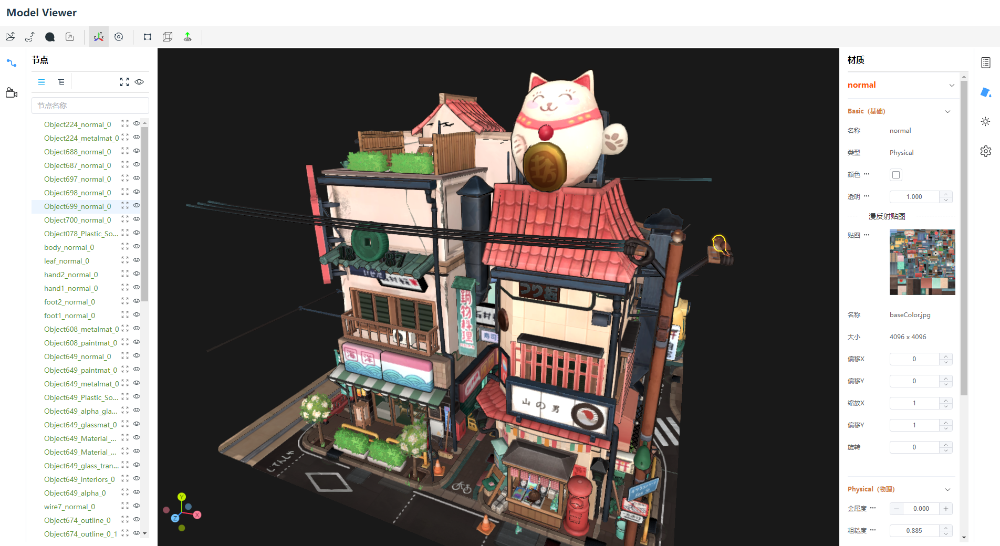

# model-view-x

[![Issues][issues-badge]][issues-badge-url]
[![DeepScan grade][deepscan]][deepscan-url]

3D模型查看器，基于ThreeJS渲染。可以打开FBX、GLTF、STL、DAE、OBJ格式模型（后续会支持更多3D模型格式）。
使用Vite + Typescript + ElementUI开发。

##### 预览界面


[在线Demo](http://www.txclub.site/model-view/index.html)

## 安装依赖
```sh
npm install
```

## 开发
```sh
npm run dev
```

## 打包
```sh
npm run build
```


[issues-badge]: https://img.shields.io/github/issues/guguTang/model-view-x.svg
[issues-badge-url]: https://github.com/guguTang/model-view-x/issues

[deepscan]: https://deepscan.io/api/teams/22516/projects/25823/branches/813407/badge/grade.svg
[deepscan-url]: https://deepscan.io/dashboard#view=project&tid=22516&pid=25823&bid=813407